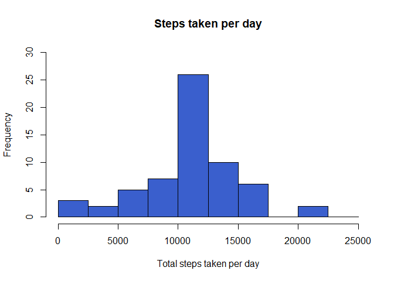

## Loading and preprocessing the data

```r
knitr::opts_chunk$set(warning=FALSE)
library(readr)
library(ggplot2)

activity <- read_csv("~/activity.csv")
```

```
## Parsed with column specification:
## cols(
##   steps = col_double(),
##   date = col_date(format = ""),
##   interval = col_double()
## )
```

```r
activity$date <- as.POSIXct(activity$date, "%Y-%m-%d")
weekday <- weekdays(activity$date)
activity <- cbind(activity,weekday)
```


## What is mean total number of steps taken per day?

```r
activity_total_steps <- with(activity, aggregate(steps, by = list(date), FUN = sum, na.rm = TRUE))
names(activity_total_steps) <- c("date", "steps")
hist(activity_total_steps$steps, main = "Steps taken per day", xlab = "Total steps taken per day", col = "royalblue3", ylim = c(0,20), breaks = seq(0,25000, by=2500))
```

<!-- -->

Mean of the total number of steps taken per day:

```r
mean(activity_total_steps$steps)
```

```
## [1] 9354.23
```

## What is the average daily activity pattern?

```r
average_day_activity <- aggregate(activity$steps, by=list(activity$interval), FUN=mean, na.rm=TRUE)
names(average_day_activity) <- c("interval", "mean")
plot(average_day_activity$interval, average_day_activity$mean, type = "l", col="royalblue3", lwd = 2, xlab="Interval", ylab="Average number of steps", main="Average number of steps per intervals")
```

<!-- -->

Which interval, on average across all the days in the dataset, contains the maximum number of steps?

```r
average_day_activity[which.max(average_day_activity$mean), ]$interval
```

```
## [1] 835
```

## Imputing missing values

Total number of missing values in the dataset:

```r
sum(is.na(activity$steps))
```

```
## [1] 2304
```

Creating new variable using the mean:

```r
imputed_steps <- average_day_activity$mean[match(activity$interval, average_day_activity$interval)]
```

Creating a new dataset with the missing data filled in:

```r
activity_imputed <- transform(activity, steps = ifelse(is.na(activity$steps), yes = imputed_steps, no = activity$steps))
total_steps_imputed <- aggregate(steps ~ date, activity_imputed, sum)
names(total_steps_imputed) <- c("date", "daily_steps")
```

Making the histogram with the new dataset:

```r
hist(total_steps_imputed$daily_steps, col = "royalblue3", xlab = "Total steps taken per day", ylim = c(0,30), main = "Steps taken per day", breaks = seq(0,25000,by=2500))
```

<!-- -->

Mean of the total steps taken per day:

```r
mean(total_steps_imputed$daily_steps)
```

```
## [1] 10766.19
```

## Are there differences in activity patterns between weekdays and weekends?

Creating a new variable with levels weekday and weekend:

```r
activity$date <- as.Date(strptime(activity$date, format="%Y-%m-%d"))
activity$datetype <- sapply(activity$date, function(x) {
        if (weekdays(x) == "sábado" | weekdays(x) =="domingo") 
                {y <- "Weekend"} else 
                {y <- "Weekday"}
                y
        })
```

Making a panel plot of the five minute interval and the average number of steps taken, averaged across weekday days or weekend days:

```r
activity_by_date <- aggregate(steps~interval + datetype, activity, mean, na.rm = TRUE)
plot<- ggplot(activity_by_date, aes(x = interval , y = steps, color = datetype)) +
       geom_line() +
       labs(title = "Average steps by day, by type of date", x = "Interval", y = "Average number of steps") +
       facet_wrap(~datetype, ncol = 1, nrow=2)
print(plot)
```

<!-- -->
